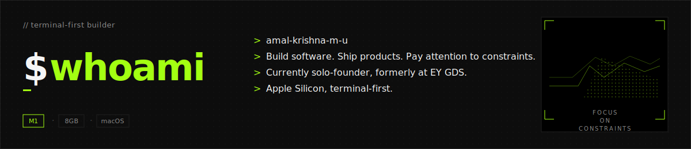
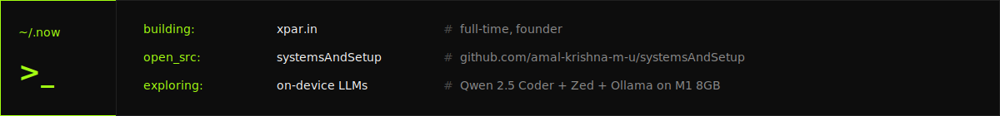
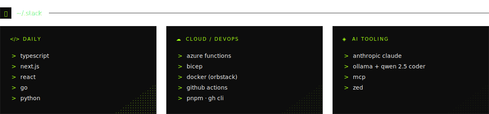
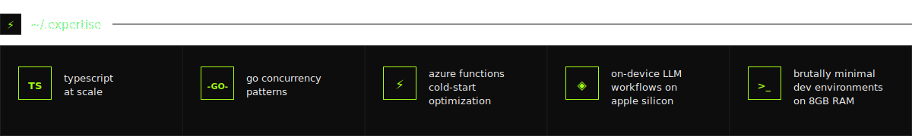

 

 

## `~/work`

|     | PROJECT             | DESCRIPTION                                                  | STACK                                  |
| :-: | :------------------ | :----------------------------------------------------------- | :------------------------------------- |
| 🟢  | **xpar.in**         | Primary product. Full-time as founder.                       | `TS` · `Next.js` · `Azure`             |
| 🟣  | **systemsAndSetup** | Reproducible MacBook dev setup. Ollama + Zed + OrbStack.     | `bash` · `plist` · `md`                |
| ⚫  | **StethoConnect**   | Digital stethoscope — college final-year project (archived). | `embedded` · `python`                  |

 

 

 

## `> git log --stat`

 

---

<table width="100%">
<tr>
<td align="left"><code>&gt; Build. Ship. Iterate.</code></td>
<td align="right"><code>EOF</code></td>
</tr>
</table>

<!--
  contact: founder@xpar.in
  site:    https://xpar.in
  github:  amal-krishna-m-u
-->
